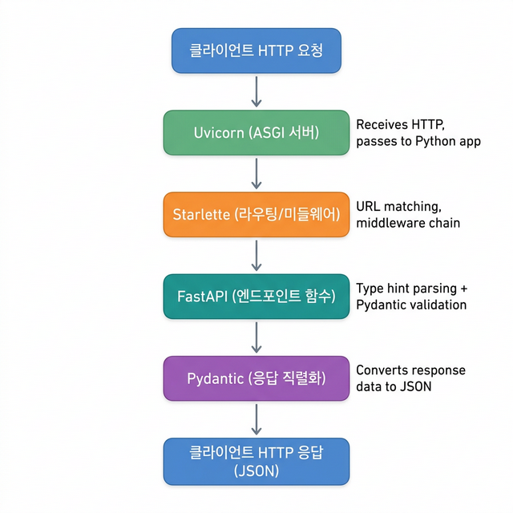

# 🛠️ 00 — 개발 환경 구성

## 학습 목표 (Goal)

FastAPI 개발에 필요한 Python, Poetry, 에디터 설정을 완료하고, 프로젝트를 초기화하여 개발을 시작할 수 있는 상태를 만듭니다.

---

## 핵심 개념 (Core Concepts)

### FastAPI란?

FastAPI는 Python으로 REST API를 구축하기 위한 고성능 웹 프레임워크입니다. 내부적으로 다음 두 가지 라이브러리를 기반으로 동작합니다:

| 구성 요소 | 역할 |
|-----------|------|
| **Starlette** | HTTP 요청/응답 처리, 라우팅, 미들웨어 등 웹 서버 기능 담당 |
| **Pydantic** | 데이터 검증(Validation), 직렬화(Serialization), 타입 변환 담당 |

FastAPI는 이 두 라이브러리 위에 Python의 타입 힌트(Type Hint)를 활용하여, 최소한의 코드로 자동 문서화와 데이터 검증을 제공합니다.

### 동작 구조 개요

```
클라이언트 요청 (HTTP)
       │
       ▼
  Uvicorn (ASGI Server)          ← HTTP 요청을 수신하여 Python 앱에 전달
       │
       ▼
  Starlette (라우팅/미들웨어)     ← URL 매칭, 미들웨어 체인 실행
       │
       ▼
  FastAPI (엔드포인트 함수)       ← 타입 힌트 기반 파라미터 파싱 + Pydantic 검증
       │
       ▼
  Pydantic (응답 직렬화)          ← 응답 데이터를 JSON으로 변환
       │
       ▼
  클라이언트 응답 (JSON)
```


### ASGI란?

ASGI(Asynchronous Server Gateway Interface)는 Python 웹 앱과 서버 사이의 표준 인터페이스입니다. 기존 WSGI(동기 방식)와 달리, 비동기(async/await) 처리를 지원하여 동시에 많은 요청을 효율적으로 처리할 수 있습니다.

- **Uvicorn**은 ASGI 서버의 구현체로, FastAPI 앱을 실행하는 데 사용됩니다.
- 개발 시에는 `--reload` 옵션으로 코드 변경을 감지하여 자동 재시작할 수 있습니다.

### Poetry란?

Poetry는 Python 프로젝트의 의존성 관리와 패키지 빌드를 통합 관리하는 도구입니다.

| 기능 | 설명 |
|------|------|
| `pyproject.toml` | 프로젝트 메타데이터, 의존성, 스크립트를 하나의 파일에 정의 |
| `poetry.lock` | 설치된 패키지의 정확한 버전을 고정하여 환경 간 재현성 보장 |
| 가상환경 자동 관리 | 프로젝트별 격리된 Python 환경을 자동으로 생성/관리 |

---

## 실습 (Hands-on)

### Step 1: Python 설치 확인

```bash
python3 --version
# Python 3.12.x 이상이어야 합니다.
# 미설치 시: https://www.python.org/downloads/
```

### Step 2: Poetry 설치

```bash
# macOS / Linux
curl -sSL https://install.python-poetry.org | python3 -

# 설치 확인
poetry --version
# Poetry (version 2.x.x)
```

> **참고**: Poetry가 이미 설치되어 있으면 이 단계를 건너뜁니다.

### Step 3: 프로젝트 초기화

```bash
# 프로젝트 디렉터리 생성
mkdir my-fastapi-app && cd my-fastapi-app

# Poetry 프로젝트 초기화
poetry init \
  --name my-fastapi-app \
  --python "^3.12" \
  --no-interaction

# FastAPI 및 Uvicorn 설치
poetry add fastapi "uvicorn[standard]"
```

설치가 완료되면 `pyproject.toml`에 다음과 같은 의존성이 추가됩니다:

```toml
[tool.poetry.dependencies]
python = "^3.12"
fastapi = "^0.133.0"
uvicorn = {extras = ["standard"], version = "^0.34.0"}
```

### Step 4: VS Code 설정 (권장)

VS Code에서 FastAPI 개발 시 유용한 확장 프로그램:

| 확장 프로그램 | 용도 |
|---------------|------|
| **Python** (ms-python) | Python 언어 지원, 디버깅 |
| **Pylance** | 타입 체크, 자동 완성 |
| **Even Better TOML** | `pyproject.toml` 편집 지원 |
| **REST Client** | `.http` 파일로 API 테스트 |

Poetry의 가상환경을 VS Code에서 인식하도록 설정합니다:

```bash
# Poetry가 프로젝트 내에 .venv를 생성하도록 설정
poetry config virtualenvs.in-project true

# 가상환경 재생성 (이미 있는 경우)
poetry env remove python3 && poetry install
```

VS Code에서 `Cmd + Shift + P` → "Python: Select Interpreter" → `.venv` 내 Python 선택.

### Step 5: 첫 번째 파일 작성

**`main.py`** 파일을 생성합니다:

```python
# main.py
from fastapi import FastAPI

app = FastAPI()

@app.get("/")
def root():
    return {"message": "Hello, FastAPI!"}
```

### Step 6: 서버 실행

```bash
# 개발 서버 실행 (코드 변경 시 자동 재시작)
poetry run uvicorn main:app --reload

# 출력 예시:
# INFO:     Uvicorn running on http://127.0.0.1:8000 (Press CTRL+C to quit)
# INFO:     Started reloader process [xxxxx] using WatchFiles
```

브라우저에서 다음 URL을 확인합니다:

| URL | 설명 |
|-----|------|
| http://127.0.0.1:8000 | API 응답 확인 (`{"message": "Hello, FastAPI!"}`) |
| http://127.0.0.1:8000/docs | Swagger UI — 자동 생성된 API 문서 |
| http://127.0.0.1:8000/redoc | ReDoc — 대체 API 문서 뷰어 |

---

## 프로젝트 구조

이 단계가 완료되면 프로젝트 디렉터리는 다음과 같습니다:

```text
my-fastapi-app/
├── .venv/              ← Poetry가 생성한 가상환경 (자동)
├── main.py             ← 작성한 API 코드
├── pyproject.toml      ← 프로젝트 설정 및 의존성
└── poetry.lock         ← 의존성 버전 잠금 파일 (자동)
```

---

## 마무리 및 다음 단계

이 단계에서 완료한 작업:
- Python 3.12+, Poetry 설치 및 확인
- FastAPI 프로젝트 초기화 및 의존성 설치
- 첫 번째 API 엔드포인트 작성 및 서버 실행
- Swagger UI를 통한 자동 문서 확인

**다음 단계**: [01 — 첫 번째 API 서버](01-hello-fastapi.md)에서 FastAPI의 라우팅 시스템과 HTTP 메서드를 본격적으로 다룹니다.
