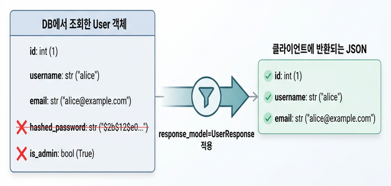

# 📤 04 — 응답 모델과 상태 코드

## 학습 목표 (Goal)

`response_model`을 사용하여 API 응답 데이터를 필터링하고, HTTP 상태 코드를 적절히 반환하는 방법을 학습합니다.

---

## 핵심 개념 (Core Concepts)

### response_model의 역할

`response_model`은 엔드포인트 데코레이터에 지정하여 **응답 데이터를 필터링**하는 기능입니다.

```
DB에서 조회한 User 객체
├── id
├── username
├── email
├── hashed_password  ← 클라이언트에 노출되면 안 됨
└── is_admin         ← 내부 필드

      │  response_model=UserResponse 적용
      ▼

클라이언트에 반환되는 JSON
├── id
├── username
└── email            ← 허용된 필드만 반환
```


동작 방식:
1. 엔드포인트 함수가 반환한 데이터를 `response_model`에 지정된 Pydantic 모델로 변환
2. 모델에 정의되지 않은 필드는 응답에서 제외됨
3. OpenAPI 문서에 응답 스키마가 자동으로 반영됨

### HTTP 상태 코드 가이드

| 코드 | 이름 | 용도 |
|------|------|------|
| 200 | OK | 조회/수정 성공 (기본값) |
| 201 | Created | 리소스 생성 성공 |
| 204 | No Content | 삭제 성공 (응답 본문 없음) |
| 400 | Bad Request | 잘못된 요청 |
| 401 | Unauthorized | 인증 필요 |
| 403 | Forbidden | 권한 없음 |
| 404 | Not Found | 리소스 없음 |
| 422 | Unprocessable Entity | 검증 실패 (FastAPI 자동 생성) |

---

## 실습 코드 (Hands-on)

### Step 1: 요청/응답 스키마 분리

실전에서는 요청 스키마와 응답 스키마를 분리하여 관리합니다. 이는 보안(비밀번호 노출 방지)과 관심사 분리(Separation of Concerns)를 위한 것입니다.

**`schemas.py`**:

```python
# schemas.py
from pydantic import BaseModel, Field, EmailStr
from datetime import datetime


# --------------------------------------------------
# 요청 스키마 (클라이언트 → 서버)
# --------------------------------------------------
class UserCreate(BaseModel):
    """사용자 생성 요청"""
    username: str = Field(..., min_length=3, max_length=30)
    email: EmailStr                         # 이메일 형식 자동 검증 (pydantic[email] 필요)
    password: str = Field(..., min_length=8)


class UserUpdate(BaseModel):
    """사용자 수정 요청 — 모든 필드 선택적"""
    username: str | None = None
    email: EmailStr | None = None


# --------------------------------------------------
# 응답 스키마 (서버 → 클라이언트)
# --------------------------------------------------
class UserResponse(BaseModel):
    """사용자 응답 — password는 포함하지 않음"""
    id: int
    username: str
    email: EmailStr
    created_at: datetime

    # ORM 객체(SQLAlchemy 모델 등)에서 직접 변환을 허용
    model_config = {"from_attributes": True}


class UserListResponse(BaseModel):
    """사용자 목록 응답 — 페이지네이션 포함"""
    total: int
    items: list[UserResponse]
```

### Step 2: response_model 적용

**`main.py`**:

```python
# main.py
from fastapi import FastAPI, HTTPException, status
from schemas import UserCreate, UserUpdate, UserResponse, UserListResponse
from datetime import datetime

app = FastAPI()

# 임시 저장소
users_db: dict[int, dict] = {}
next_id = 1


# --------------------------------------------------
# POST — 생성 (201 Created)
# --------------------------------------------------
@app.post(
    "/users",
    response_model=UserResponse,      # 응답에서 password 필드 자동 제외
    status_code=status.HTTP_201_CREATED,
)
def create_user(user: UserCreate):
    global next_id
    user_data = {
        "id": next_id,
        **user.model_dump(),
        "hashed_password": f"hashed_{user.password}",  # 실제로는 bcrypt 등으로 해시
        "created_at": datetime.now(),
    }
    # password를 저장하지 않고 hashed_password만 저장
    del user_data["password"]
    users_db[next_id] = user_data
    next_id += 1

    # response_model=UserResponse이므로
    # id, username, email, created_at만 반환됨
    # hashed_password는 응답에 포함되지 않음
    return user_data


# --------------------------------------------------
# GET — 단건 조회 (200 OK)
# --------------------------------------------------
@app.get("/users/{user_id}", response_model=UserResponse)
def get_user(user_id: int):
    if user_id not in users_db:
        raise HTTPException(
            status_code=status.HTTP_404_NOT_FOUND,
            detail=f"User {user_id} not found",
        )
    return users_db[user_id]


# --------------------------------------------------
# GET — 목록 조회 (페이지네이션 포함)
# --------------------------------------------------
@app.get("/users", response_model=UserListResponse)
def list_users(skip: int = 0, limit: int = 10):
    all_users = list(users_db.values())
    return {
        "total": len(all_users),
        "items": all_users[skip : skip + limit],
    }


# --------------------------------------------------
# PATCH — 부분 수정
# --------------------------------------------------
@app.patch("/users/{user_id}", response_model=UserResponse)
def update_user(user_id: int, user: UserUpdate):
    if user_id not in users_db:
        raise HTTPException(status_code=404, detail="User not found")

    stored_user = users_db[user_id]

    # exclude_unset=True: 클라이언트가 보내지 않은 필드는 제외
    update_data = user.model_dump(exclude_unset=True)
    for field, value in update_data.items():
        stored_user[field] = value

    return stored_user


# --------------------------------------------------
# DELETE — 삭제 (204 No Content)
# --------------------------------------------------
@app.delete("/users/{user_id}", status_code=status.HTTP_204_NO_CONTENT)
def delete_user(user_id: int):
    if user_id not in users_db:
        raise HTTPException(status_code=404, detail="User not found")
    del users_db[user_id]
    # 204 응답은 본문이 없으므로 return 없음
```

### Step 3: 다중 응답 타입 정의

OpenAPI 문서에 에러 응답 스키마를 포함하려면 `responses` 파라미터를 사용합니다:

```python
# schemas.py (이어서 추가)

class ErrorResponse(BaseModel):
    """공통 에러 응답 스키마"""
    detail: str


# main.py (이어서 추가)

@app.get(
    "/users/{user_id}",
    response_model=UserResponse,
    responses={
        404: {
            "model": ErrorResponse,
            "description": "사용자를 찾을 수 없음",
        },
    },
)
def get_user(user_id: int):
    ...
```

### Step 4: response_model_exclude_none과 기타 옵션

```python
# 응답에서 None 값을 가진 필드를 제외
@app.get(
    "/users/{user_id}",
    response_model=UserResponse,
    response_model_exclude_none=True,  # None인 필드는 응답 JSON에서 제거
)
def get_user(user_id: int):
    ...
```

---

## from_attributes 동작 원리

`model_config = {"from_attributes": True}` 설정은 SQLAlchemy ORM 객체처럼 dict가 아닌 속성(attribute) 기반 객체를 Pydantic 모델로 변환할 수 있게 합니다.

```python
# SQLAlchemy ORM 객체 (dict가 아님)
class UserORM:
    id = 1
    username = "hong"
    email = "hong@example.com"
    created_at = datetime.now()

user_orm = UserORM()

# from_attributes=True가 없으면 → 에러
# from_attributes=True가 있으면 → 정상 변환
UserResponse.model_validate(user_orm)
```

---

## 마무리 및 다음 단계

이 단계에서 완료한 작업:
- 요청/응답 스키마 분리 패턴 (보안 및 관심사 분리)
- `response_model`을 사용한 응답 필터링
- HTTP 상태 코드 활용 (`status.HTTP_201_CREATED` 등)
- `model_dump(exclude_unset=True)`를 활용한 PATCH 구현
- `from_attributes` 설정으로 ORM 객체 변환

**다음 단계**: [05 — 폼 데이터와 파일 업로드](05-form-and-file-upload.md)에서 JSON이 아닌 폼 데이터와 파일을 처리하는 방법을 학습합니다.
