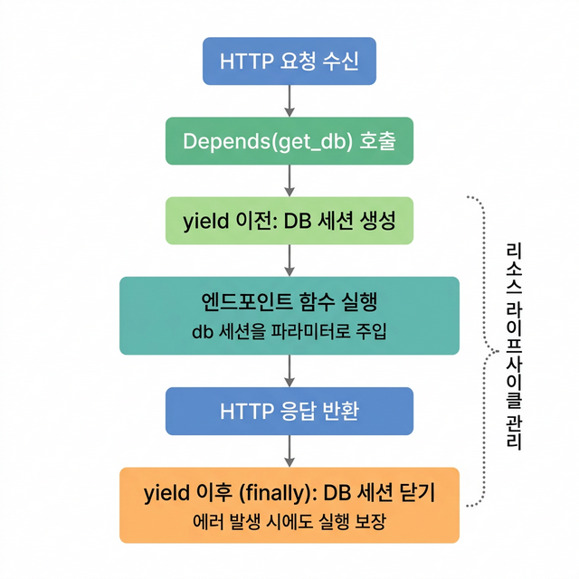

# 🔌 06 — 의존성 주입 (Dependency Injection)

## 학습 목표 (Goal)

FastAPI의 의존성 주입(DI) 시스템을 이해하고, 재사용 가능한 로직을 체계적으로 구성하는 방법을 학습합니다.

---

## 핵심 개념 (Core Concepts)

### 의존성 주입이란?

의존성 주입(Dependency Injection)은 함수가 필요로 하는 객체나 값을 **외부에서 주입**하는 디자인 패턴입니다. FastAPI에서는 `Depends()`를 사용하여 이를 구현합니다.

DI를 사용하는 이유:

| 이점 | 설명 |
|------|------|
| **코드 재사용** | 공통 로직(DB 세션, 인증, 설정값 조회)을 한 곳에 정의하고 여러 엔드포인트에서 재사용 |
| **테스트 용이성** | 테스트 시 의존성을 교체(override)하여 DB 대신 목(mock) 객체 사용 가능 |
| **관심사 분리** | 비즈니스 로직과 인프라 로직(DB, 인증)을 분리 |
| **자동 정리** | `yield`를 사용하면 응답 완료 후 자동으로 리소스 정리 (DB 세션 닫기 등) |

### 실행 흐름

```
요청 수신
   │
   ▼
Depends(get_db) 호출
   ├── yield 이전: DB 세션 생성
   │
   ▼
엔드포인트 함수 실행
   │
   ▼
응답 반환
   │
   ▼
yield 이후: DB 세션 닫기 (finally 블록)
```


---

## 실습 코드 (Hands-on)

### Step 1: 기본 의존성

```python
# main.py
from fastapi import FastAPI, Depends, Query
from typing import Annotated

app = FastAPI()


# --------------------------------------------------
# 함수형 의존성 — 공통 쿼리 파라미터 추출
# --------------------------------------------------
def common_pagination(
    skip: int = Query(0, ge=0, description="건너뛸 항목 수"),
    limit: int = Query(10, ge=1, le=100, description="조회할 최대 항목 수"),
) -> dict:
    """여러 엔드포인트에서 재사용할 페이지네이션 파라미터"""
    return {"skip": skip, "limit": limit}


# Annotated로 의존성 타입 별칭 정의 (권장 방식)
Pagination = Annotated[dict, Depends(common_pagination)]


@app.get("/items")
def list_items(pagination: Pagination):
    """common_pagination의 반환값이 pagination에 주입됩니다"""
    return {"pagination": pagination}


@app.get("/users")
def list_users(pagination: Pagination):
    """동일한 의존성을 재사용"""
    return {"pagination": pagination}
```

### Step 2: yield 의존성 (리소스 관리)

DB 세션처럼 사용 후 반드시 닫아야 하는 리소스는 `yield`를 사용합니다:

```python
# dependencies.py
from typing import Generator


# 가상의 DB 세션 (실제로는 SQLAlchemy 세션)
class FakeDBSession:
    def __init__(self):
        print("  [DB] 세션 열림")

    def query(self, model):
        return f"querying {model}"

    def close(self):
        print("  [DB] 세션 닫힘")


def get_db() -> Generator[FakeDBSession, None, None]:
    """
    yield 의존성:
    1. yield 이전: 리소스 생성 (DB 세션 열기)
    2. yield: 엔드포인트 함수에 리소스 전달
    3. yield 이후 (finally): 리소스 정리 (DB 세션 닫기)
    
    에러가 발생해도 finally 블록은 반드시 실행됩니다.
    """
    db = FakeDBSession()
    try:
        yield db
    finally:
        db.close()
```

```python
# main.py (이어서 추가)
from dependencies import get_db, FakeDBSession

DbSession = Annotated[FakeDBSession, Depends(get_db)]


@app.get("/products")
def list_products(db: DbSession):
    """
    요청이 들어오면:
    1. get_db()가 실행되어 DB 세션 생성
    2. 세션이 db 파라미터에 주입
    3. 응답 반환 후 세션 자동 닫힘
    """
    return {"result": db.query("Product")}
```

### Step 3: 의존성 체이닝 (계층화)

의존성은 다른 의존성에 의존할 수 있습니다:

```python
# dependencies.py (이어서 추가)

def get_current_user(db: FakeDBSession = Depends(get_db)) -> dict:
    """
    get_db → get_current_user 순서로 의존성이 해결됩니다.
    DB 세션을 사용하여 현재 사용자를 조회합니다.
    """
    # 실제로는 토큰에서 user_id를 추출하여 DB 조회
    return {"id": 1, "username": "hong", "role": "admin"}


def require_admin(current_user: dict = Depends(get_current_user)) -> dict:
    """
    get_db → get_current_user → require_admin
    관리자 권한 검증을 위한 의존성 체인
    """
    if current_user.get("role") != "admin":
        from fastapi import HTTPException
        raise HTTPException(status_code=403, detail="관리자 권한이 필요합니다")
    return current_user
```

```python
# main.py (이어서 추가)
from dependencies import get_current_user, require_admin

CurrentUser = Annotated[dict, Depends(get_current_user)]
AdminUser = Annotated[dict, Depends(require_admin)]


@app.get("/me")
def read_current_user(user: CurrentUser):
    """인증된 사용자만 접근 가능"""
    return user


@app.delete("/admin/users/{user_id}")
def delete_user(user_id: int, admin: AdminUser):
    """관리자만 접근 가능"""
    return {"deleted": user_id, "by": admin["username"]}
```

### Step 4: 클래스 기반 의존성

복잡한 의존성은 클래스로 정의할 수 있습니다:

```python
# dependencies.py (이어서 추가)
from fastapi import Query


class ItemFilter:
    """아이템 필터 조건을 캡슐화하는 클래스형 의존성"""

    def __init__(
        self,
        q: str | None = Query(None, description="검색어"),
        min_price: float | None = Query(None, ge=0, description="최소 가격"),
        max_price: float | None = Query(None, ge=0, description="최대 가격"),
        category: str | None = Query(None, description="카테고리"),
    ):
        self.q = q
        self.min_price = min_price
        self.max_price = max_price
        self.category = category

    def has_filters(self) -> bool:
        return any([self.q, self.min_price, self.max_price, self.category])
```

```python
# main.py (이어서 추가)
from dependencies import ItemFilter

ItemFilterDep = Annotated[ItemFilter, Depends()]  # 클래스 자체를 Depends에 전달


@app.get("/filtered-items")
def get_filtered_items(filters: ItemFilterDep):
    """
    GET /filtered-items?q=노트북&min_price=500000&category=전자
    → filters.q = "노트북", filters.min_price = 500000, ...
    """
    result = {"has_filters": filters.has_filters()}
    if filters.q:
        result["search"] = filters.q
    if filters.min_price:
        result["min_price"] = filters.min_price
    return result
```

### Step 5: 라우터/앱 전체에 의존성 적용

```python
from fastapi import APIRouter

# 라우터의 모든 엔드포인트에 의존성 적용
admin_router = APIRouter(
    prefix="/admin",
    tags=["Admin"],
    dependencies=[Depends(require_admin)],  # 이 라우터의 모든 엔드포인트에 적용
)

@admin_router.get("/dashboard")
def admin_dashboard():
    """require_admin이 자동으로 적용됨"""
    return {"dashboard": "admin"}

# 앱 전체에 의존성 적용 (모든 엔드포인트)
# app = FastAPI(dependencies=[Depends(verify_api_key)])
```

---

## 마무리 및 다음 단계

이 단계에서 완료한 작업:
- `Depends()`를 사용한 함수형 의존성 정의
- `yield` 의존성을 활용한 리소스 라이프사이클 관리
- 의존성 체이닝(체인 구성)
- 클래스 기반 의존성으로 복잡한 로직 캡슐화
- `Annotated` 타입 별칭을 활용한 의존성 관리
- 라우터/앱 단위 의존성 적용

**다음 단계**: [07 — 데이터베이스 연동](07-database-sqlalchemy.md)에서 SQLAlchemy 2.0과 FastAPI를 연동하여 실제 데이터베이스를 사용하는 CRUD API를 구현합니다.
