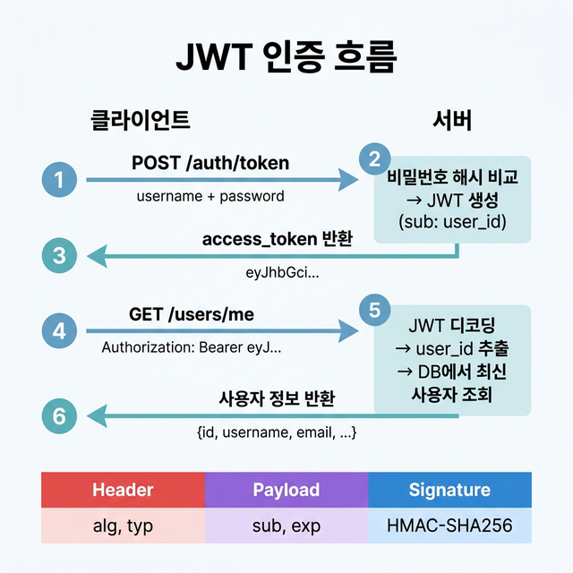

# 🔐 08 — 인증과 JWT

## 학습 목표 (Goal)

OAuth2 Password Flow와 JWT(JSON Web Token)를 사용하여 사용자 인증 시스템을 구현합니다. 토큰 발급, 검증, 보호 엔드포인트 접근 제어 흐름을 이해합니다.

---

## 핵심 개념 (Core Concepts)

### 인증 흐름 (OAuth2 Password Flow)

```
1. 로그인 요청
   POST /auth/token
   Body: username=hong&password=secret
          │
          ▼
2. 서버: 사용자 검증 + JWT 토큰 생성
   ├── DB에서 username으로 사용자 조회
   ├── 비밀번호 해시 비교 (bcrypt)
   └── 검증 성공 → JWT 액세스 토큰 발급
          │
          ▼
3. 토큰 반환
   {"access_token": "eyJ...", "token_type": "bearer"}
          │
          ▼
4. 보호된 API 호출
   GET /users/me
   Headers: Authorization: Bearer eyJ...
          │
          ▼
5. 서버: 토큰 검증
   ├── JWT 디코딩 + 서명 검증
   ├── 만료 시간 확인
   └── 사용자 정보 추출 → 엔드포인트에 주입
```


### JWT 구조

JWT는 점(`.`)으로 구분된 세 부분으로 구성됩니다:

```
eyJhbGciOiJIUzI1NiJ9.eyJzdWIiOiJob25nIiwiZXhwIjoxNzA5MTIzNDU2fQ.signature
├── Header ─────────┤├── Payload ─────────────────────────────┤├─ Signature ┤
```

| 부분 | 내용 |
|------|------|
| **Header** | 알고리즘(`HS256`), 토큰 타입(`JWT`) |
| **Payload** | 사용자 식별자(`sub`), 만료 시간(`exp`), 기타 클레임 |
| **Signature** | Header + Payload를 비밀키(SECRET_KEY)로 서명한 값 |

> **주의**: Payload는 Base64 인코딩일 뿐 암호화가 아닙니다. 민감 정보(비밀번호 등)를 Payload에 포함하면 안 됩니다.

### 비밀번호 해싱

비밀번호는 절대 평문으로 저장하지 않습니다. `bcrypt` 알고리즘을 사용하여 단방향 해시를 생성합니다:

```
password: "secret123"
    │
    ▼  bcrypt.hash()
hashed: "$2b$12$LJ3m4ys3..."   ← DB에 저장
    │
    ▼  bcrypt.verify("secret123", hashed)
result: True                    ← 검증 시 해시 비교
```

---

## 실습 코드 (Hands-on)

### Step 1: 필요한 패키지 확인

`pyproject.toml`에 이미 포함된 패키지들:

```toml
python-jose = {extras = ["cryptography"], version = "^3.3"}  # JWT 생성/검증
passlib = {extras = ["bcrypt"], version = "^1.7"}             # 비밀번호 해싱
```

### Step 2: 인증 모듈 작성

**`auth.py`**:

```python
# auth.py
from datetime import datetime, timedelta, timezone
from typing import Annotated

from fastapi import Depends, HTTPException, status
from fastapi.security import OAuth2PasswordBearer
from jose import JWTError, jwt
from passlib.context import CryptContext
from pydantic import BaseModel

# --------------------------------------------------
# 설정값 (프로덕션에서는 환경 변수로 관리)
# --------------------------------------------------
SECRET_KEY = "your-secret-key-change-this-in-production"
ALGORITHM = "HS256"
ACCESS_TOKEN_EXPIRE_MINUTES = 60

# --------------------------------------------------
# 비밀번호 해싱 설정
# --------------------------------------------------
pwd_context = CryptContext(schemes=["bcrypt"], deprecated="auto")

# --------------------------------------------------
# OAuth2 스키마 설정
# - tokenUrl: 로그인 엔드포인트 경로
# - Swagger UI의 "Authorize" 버튼에서 이 경로로 토큰 요청
# --------------------------------------------------
oauth2_scheme = OAuth2PasswordBearer(tokenUrl="/auth/token")


# --------------------------------------------------
# 토큰 응답 스키마
# --------------------------------------------------
class Token(BaseModel):
    access_token: str
    token_type: str


class TokenData(BaseModel):
    username: str | None = None


# --------------------------------------------------
# 비밀번호 관련 유틸리티
# --------------------------------------------------
def verify_password(plain_password: str, hashed_password: str) -> bool:
    """평문 비밀번호와 해시된 비밀번호를 비교"""
    return pwd_context.verify(plain_password, hashed_password)


def get_password_hash(password: str) -> str:
    """비밀번호를 bcrypt로 해시"""
    return pwd_context.hash(password)


# --------------------------------------------------
# JWT 토큰 생성
# --------------------------------------------------
def create_access_token(data: dict, expires_delta: timedelta | None = None) -> str:
    """
    JWT 액세스 토큰을 생성합니다.
    
    Args:
        data: 토큰에 포함할 데이터 (예: {"sub": "username"})
        expires_delta: 토큰 만료 시간
    """
    to_encode = data.copy()
    expire = datetime.now(timezone.utc) + (expires_delta or timedelta(minutes=15))
    to_encode.update({"exp": expire})
    return jwt.encode(to_encode, SECRET_KEY, algorithm=ALGORITHM)


# --------------------------------------------------
# 현재 사용자 추출 의존성
# --------------------------------------------------
async def get_current_user(token: Annotated[str, Depends(oauth2_scheme)]):
    """
    Authorization 헤더에서 Bearer 토큰을 추출하고 검증합니다.
    
    동작 과정:
    1. oauth2_scheme이 Authorization 헤더에서 토큰 추출
    2. JWT 디코딩 + 서명 검증
    3. payload에서 username(sub) 추출
    4. DB에서 사용자 조회 (여기서는 단순화)
    """
    credentials_exception = HTTPException(
        status_code=status.HTTP_401_UNAUTHORIZED,
        detail="인증 정보를 확인할 수 없습니다",
        headers={"WWW-Authenticate": "Bearer"},
    )
    try:
        payload = jwt.decode(token, SECRET_KEY, algorithms=[ALGORITHM])
        username: str = payload.get("sub")
        if username is None:
            raise credentials_exception
    except JWTError:
        raise credentials_exception

    # 실제로는 DB에서 사용자 조회
    # user = crud.get_user_by_username(db, username=username)
    # if user is None:
    #     raise credentials_exception
    # return user

    return {"username": username}
```

### Step 3: 인증 라우터 작성

**`routers/auth.py`**:

```python
# routers/auth.py
from datetime import timedelta
from typing import Annotated

from fastapi import APIRouter, Depends, HTTPException, status
from fastapi.security import OAuth2PasswordRequestForm

from auth import (
    Token,
    verify_password,
    get_password_hash,
    create_access_token,
    ACCESS_TOKEN_EXPIRE_MINUTES,
)

router = APIRouter(prefix="/auth", tags=["Authentication"])

# 임시 사용자 DB (실제로는 SQLAlchemy 모델 사용)
fake_users_db = {
    "hong": {
        "username": "hong",
        "email": "hong@example.com",
        "hashed_password": get_password_hash("secret123"),
        "is_active": True,
    }
}


def authenticate_user(username: str, password: str) -> dict | None:
    """사용자 인증: username으로 조회 후 비밀번호 해시 비교"""
    user = fake_users_db.get(username)
    if not user:
        return None
    if not verify_password(password, user["hashed_password"]):
        return None
    return user


@router.post("/token", response_model=Token)
def login(form_data: Annotated[OAuth2PasswordRequestForm, Depends()]):
    """
    로그인 엔드포인트.
    
    OAuth2PasswordRequestForm은 다음 폼 필드를 자동으로 수신합니다:
    - username (필수)
    - password (필수)
    - scope (선택)
    - grant_type (선택)
    """
    user = authenticate_user(form_data.username, form_data.password)
    if not user:
        raise HTTPException(
            status_code=status.HTTP_401_UNAUTHORIZED,
            detail="사용자 이름 또는 비밀번호가 올바르지 않습니다",
            headers={"WWW-Authenticate": "Bearer"},
        )

    access_token = create_access_token(
        data={"sub": user["username"]},
        expires_delta=timedelta(minutes=ACCESS_TOKEN_EXPIRE_MINUTES),
    )
    return Token(access_token=access_token, token_type="bearer")
```

### Step 4: 보호 엔드포인트 구성

**`main.py`**:

```python
# main.py
from fastapi import FastAPI, Depends
from typing import Annotated

from auth import get_current_user
from routers.auth import router as auth_router

app = FastAPI(title="Auth Demo API")

# 인증 라우터 등록
app.include_router(auth_router)

# 현재 사용자 의존성 타입 별칭
CurrentUser = Annotated[dict, Depends(get_current_user)]


@app.get("/")
def root():
    return {"message": "Auth Demo API"}


@app.get("/users/me")
def read_current_user(current_user: CurrentUser):
    """
    이 엔드포인트는 유효한 JWT 토큰이 있어야 접근 가능합니다.
    
    Swagger UI에서 테스트:
    1. POST /auth/token 으로 로그인 (username: hong, password: secret123)
    2. 반환된 토큰을 복사
    3. 우측 상단 "Authorize" 버튼 클릭 → 토큰 입력
    4. GET /users/me 실행 → 현재 사용자 정보 반환
    """
    return current_user


@app.get("/protected")
def protected_route(current_user: CurrentUser):
    """인증이 필요한 보호 경로"""
    return {
        "message": f"안녕하세요, {current_user['username']}님!",
        "status": "authenticated",
    }
```

### Step 5: 실행 및 테스트

```bash
poetry run uvicorn main:app --reload
```

Swagger UI(http://127.0.0.1:8000/docs)에서:

1. `POST /auth/token` 실행: `username=hong`, `password=secret123`
2. 응답에서 `access_token` 값 복사
3. 페이지 우측 상단 **Authorize** 버튼 클릭 → 토큰 붙여넣기
4. `GET /users/me` 실행 → 인증된 사용자 정보 반환 확인
5. 잘못된 토큰이나 만료된 토큰으로 시도 → 401 에러 확인

---

## 프로덕션 환경에서의 고려사항

| 항목 | 권장 사항 |
|------|-----------|
| SECRET_KEY | 환경 변수로 관리 (`os.environ.get("SECRET_KEY")`) |
| 토큰 만료 | 액세스 토큰 15~60분, 리프레시 토큰 7~30일 |
| HTTPS | 프로덕션에서는 반드시 HTTPS 사용 (토큰 탈취 방지) |
| 리프레시 토큰 | 액세스 토큰 갱신을 위한 별도 엔드포인트 구현 |
| 비밀번호 정책 | 최소 길이, 복잡성 규칙 적용 |

---

## 마무리 및 다음 단계

이 단계에서 완료한 작업:
- JWT 토큰의 구조와 동작 원리 이해
- `passlib`을 사용한 비밀번호 해싱
- `python-jose`를 사용한 JWT 생성/검증
- OAuth2PasswordBearer를 사용한 토큰 추출
- 보호 엔드포인트 구성 (Depends을 활용한 인증 체인)

**다음 단계**: [09 — 에러 핸들링](09-error-handling.md)에서 API 에러를 체계적으로 관리하고, 커스텀 에러 핸들러를 구성하는 방법을 학습합니다.
