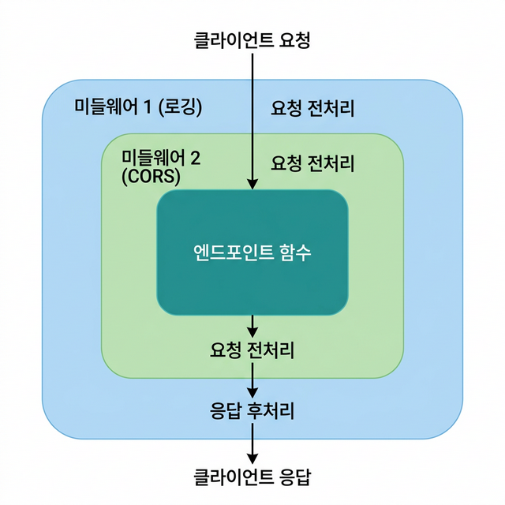

# 🔗 10 — 미들웨어와 CORS

## 학습 목표 (Goal)

FastAPI의 미들웨어 시스템을 이해하고, 요청/응답 처리 파이프라인에 공통 로직(로깅, 인증, CORS 등)을 삽입하는 방법을 학습합니다.

---

## 핵심 개념 (Core Concepts)

### 미들웨어란?

미들웨어(Middleware)는 **모든 요청과 응답** 사이에 삽입되는 처리 계층입니다. 엔드포인트 함수가 실행되기 전과 후에 공통 로직을 수행합니다.

```
클라이언트 요청
       │
       ▼
┌─ 미들웨어 1 (예: 로깅) ──────────────┐
│  요청 전처리                          │
│       │                              │
│  ┌─ 미들웨어 2 (예: CORS) ─────────┐ │
│  │  요청 전처리                     │ │
│  │       │                         │ │
│  │  엔드포인트 함수 실행            │ │
│  │       │                         │ │
│  │  응답 후처리                     │ │
│  └────────────────────────────────┘ │
│  응답 후처리                          │
└──────────────────────────────────────┘
       │
       ▼
클라이언트 응답
```



미들웨어는 **등록된 역순**으로 요청을 처리합니다 (마지막에 등록된 미들웨어가 가장 먼저 실행).

### CORS란?

CORS(Cross-Origin Resource Sharing)는 브라우저에서 **다른 도메인**의 API를 호출할 때 적용되는 보안 정책입니다.

```
프론트엔드: http://localhost:3000
API 서버:   http://localhost:8000
→ 도메인(포트)이 다르므로 CORS 설정 필요
```

CORS 설정이 없으면 브라우저가 API 응답을 차단합니다. 서버에서 `Access-Control-Allow-Origin` 헤더를 반환하여 특정 도메인의 접근을 허용해야 합니다.

---

## 실습 코드 (Hands-on)

### Step 1: 커스텀 미들웨어 작성

```python
# main.py
import time
import logging
from fastapi import FastAPI, Request

logging.basicConfig(level=logging.INFO)
logger = logging.getLogger(__name__)

app = FastAPI()


# --------------------------------------------------
# 미들웨어 1: 요청 처리 시간 측정
# --------------------------------------------------
@app.middleware("http")
async def add_process_time_header(request: Request, call_next):
    """
    모든 요청의 처리 시간을 측정하여 응답 헤더에 추가합니다.
    
    동작 순서:
    1. 요청 수신 시 시작 시간 기록
    2. call_next(request)로 다음 미들웨어 또는 엔드포인트에 요청 전달
    3. 응답이 돌아오면 처리 시간 계산
    4. 응답 헤더에 X-Process-Time 추가
    """
    start_time = time.perf_counter()

    # 다음 미들웨어 또는 엔드포인트 호출
    response = await call_next(request)

    process_time = time.perf_counter() - start_time
    response.headers["X-Process-Time"] = f"{process_time:.4f}"
    return response


# --------------------------------------------------
# 미들웨어 2: 요청/응답 로깅
# --------------------------------------------------
@app.middleware("http")
async def log_requests(request: Request, call_next):
    """모든 요청과 응답을 로깅합니다"""
    # 요청 로깅
    logger.info(f"→ {request.method} {request.url.path}")

    response = await call_next(request)

    # 응답 로깅
    logger.info(f"← {request.method} {request.url.path} → {response.status_code}")
    return response


# --------------------------------------------------
# 미들웨어 3: 커스텀 헤더 추가
# --------------------------------------------------
@app.middleware("http")
async def add_custom_headers(request: Request, call_next):
    """응답에 커스텀 헤더를 추가합니다"""
    response = await call_next(request)
    response.headers["X-App-Version"] = "1.0.0"
    response.headers["X-Request-ID"] = str(id(request))  # 실제로는 UUID 사용
    return response


@app.get("/")
def root():
    return {"message": "Hello with middleware!"}


@app.get("/items")
def list_items():
    return [{"id": 1, "name": "노트북"}]
```

### Step 2: CORS 설정

```python
# main.py (이어서 추가)
from fastapi.middleware.cors import CORSMiddleware

# CORS 미들웨어 추가
app.add_middleware(
    CORSMiddleware,
    # 허용할 출처 (Origin) 목록
    allow_origins=[
        "http://localhost:3000",      # React 개발 서버
        "http://localhost:5173",      # Vite 개발 서버
        "https://my-app.example.com", # 프로덕션 프론트엔드
    ],
    # 인증 정보(쿠키, Authorization 헤더) 포함 허용
    allow_credentials=True,
    # 허용할 HTTP 메서드
    allow_methods=["*"],  # 모든 메서드 허용. 또는 ["GET", "POST"] 등으로 제한
    # 허용할 요청 헤더
    allow_headers=["*"],  # 모든 헤더 허용
    # 브라우저에 노출할 응답 헤더
    expose_headers=["X-Process-Time", "X-Request-ID"],
)
```

> **주의**: `allow_origins=["*"]`로 모든 도메인을 허용하면 편리하지만, `allow_credentials=True`와 함께 사용할 수 없습니다. 프로덕션에서는 반드시 허용할 도메인을 명시합니다.

### Step 3: 클래스 기반 미들웨어 (BaseHTTPMiddleware)

더 복잡한 미들웨어는 클래스로 작성합니다:

```python
# middleware.py
from starlette.middleware.base import BaseHTTPMiddleware
from starlette.requests import Request
from starlette.responses import Response, JSONResponse
import time
import logging

logger = logging.getLogger(__name__)


class RateLimitMiddleware(BaseHTTPMiddleware):
    """
    간단한 요청 속도 제한 미들웨어.
    IP별로 일정 시간 내 요청 수를 제한합니다.
    
    참고: 프로덕션에서는 Redis 기반의 외부 라이브러리 사용을 권장합니다.
    """

    def __init__(self, app, max_requests: int = 10, window_seconds: int = 60):
        super().__init__(app)
        self.max_requests = max_requests
        self.window_seconds = window_seconds
        self.requests: dict[str, list[float]] = {}  # IP → [타임스탬프 목록]

    async def dispatch(self, request: Request, call_next) -> Response:
        client_ip = request.client.host
        now = time.time()

        # 이 IP의 요청 기록 조회
        if client_ip not in self.requests:
            self.requests[client_ip] = []

        # 시간 윈도우 내의 요청만 유지
        self.requests[client_ip] = [
            t for t in self.requests[client_ip]
            if now - t < self.window_seconds
        ]

        # 요청 수 초과 확인
        if len(self.requests[client_ip]) >= self.max_requests:
            return JSONResponse(
                status_code=429,
                content={"detail": "요청이 과다합니다. 잠시 후 다시 시도하세요."},
            )

        # 현재 요청 기록
        self.requests[client_ip].append(now)

        response = await call_next(request)
        return response
```

```python
# main.py (이어서 추가)
from middleware import RateLimitMiddleware

# 클래스 기반 미들웨어 등록
app.add_middleware(RateLimitMiddleware, max_requests=100, window_seconds=60)
```

### Step 4: Trusted Host 미들웨어

허용된 호스트만 접근할 수 있도록 제한합니다:

```python
# main.py (이어서 추가)
from starlette.middleware.trustedhost import TrustedHostMiddleware

# 허용된 호스트만 접근 가능 (Host 헤더 검증)
app.add_middleware(
    TrustedHostMiddleware,
    allowed_hosts=["localhost", "127.0.0.1", "my-app.example.com"],
)
```

---

## 미들웨어 실행 순서 정리

```python
# 미들웨어는 add_middleware()의 역순으로 실행됩니다.
# 아래와 같이 등록하면:
app.add_middleware(CORSMiddleware, ...)      # 3번째 등록
app.add_middleware(RateLimitMiddleware, ...)  # 2번째 등록

@app.middleware("http")
async def logging_middleware(request, call_next):  # 1번째 등록 (데코레이터)
    ...

# 실행 순서:
# 요청 → logging → RateLimit → CORS → 엔드포인트
# 응답 → CORS → RateLimit → logging → 클라이언트
```

---

## 마무리 및 다음 단계

이 단계에서 완료한 작업:
- `@app.middleware("http")`를 사용한 함수형 미들웨어
- `CORSMiddleware` 설정 및 옵션 설명
- `BaseHTTPMiddleware`를 상속한 클래스 기반 미들웨어
- 미들웨어 실행 순서 이해

**다음 단계**: [11 — 백그라운드 태스크](11-background-tasks.md)에서 응답 반환 후 비동기적으로 작업을 실행하는 방법을 학습합니다.
