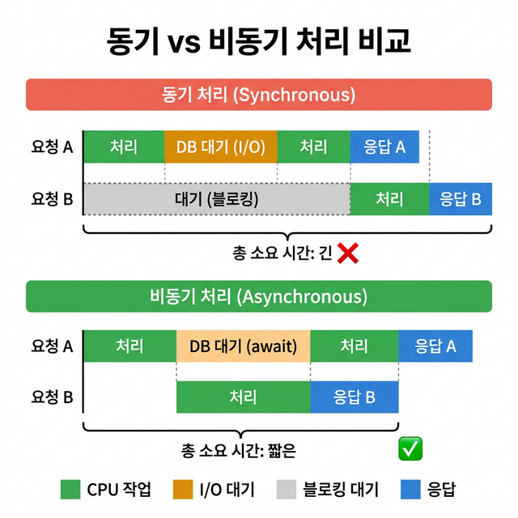

# ⚡ 13 — 비동기 처리와 성능

## 학습 목표 (Goal)

FastAPI의 비동기(async/await) 동작 원리를 이해하고, `def` vs `async def`의 차이, 동시성 모델, 성능 최적화 기법을 학습합니다.

---

## 핵심 개념 (Core Concepts)

### 동기 vs 비동기 처리

```
(동기 처리 — 순차 실행)
요청A 도착 ─[처리]─[DB 대기]─[처리]─ 응답A
요청B 도착 ─────────────────────── 대기 ─[처리]─ 응답B

(비동기 처리 — 대기 시간에 다른 작업 수행)
요청A 도착 ─[처리]─[DB 대기...    ]─[처리]─ 응답A
요청B 도착 ─────────[처리]─ 응답B  ↑ (대기 중 B를 처리)
```



비동기 처리의 핵심은 **I/O 대기 시간을 활용**하는 것입니다. 네트워크 요청, DB 쿼리, 파일 읽기 등 I/O 작업에서 CPU가 유휴 상태일 때 다른 요청을 처리합니다.

### FastAPI에서 def vs async def

| 구분 | `def` (동기 함수) | `async def` (비동기 함수) |
|------|-------------------|--------------------------|
| 실행 위치 | **스레드 풀**에서 실행 | **이벤트 루프**에서 실행 |
| I/O 처리 | 블로킹 I/O 사용 가능 | `await` 비동기 I/O 사용 |
| 적합한 작업 | 동기 DB 라이브러리, 계산 작업 | 비동기 HTTP 클라이언트, 비동기 DB |
| 동시성 | 각 요청이 별도 스레드 | 단일 스레드에서 코루틴 전환 |

> **중요**: `async def` 함수 내에서 동기 블로킹 코드(예: `time.sleep()`, 동기 DB 쿼리)를 실행하면 이벤트 루프 전체가 차단됩니다. 이 경우 `def`를 사용하거나 `run_in_executor`로 별도 스레드에서 실행해야 합니다.

### FastAPI의 내부 동시성 구조

```
Uvicorn (ASGI Server)
       │
       ▼
  이벤트 루프 (asyncio)               ← 단일 스레드
       │
       ├── async def 엔드포인트        ← 이벤트 루프에서 직접 실행
       │     └── await 비동기_작업     ← 대기 중 다른 코루틴 실행
       │
       └── def 엔드포인트              ← 스레드 풀로 위임
             └── 동기 블로킹 코드      ← 별도 스레드에서 실행
```

---

## 실습 코드 (Hands-on)

### Step 1: def vs async def 비교

```python
# main.py
import time
import asyncio
from fastapi import FastAPI

app = FastAPI()


# --------------------------------------------------
# 동기 함수 — 스레드 풀에서 실행
# --------------------------------------------------
@app.get("/sync")
def sync_endpoint():
    """
    def으로 정의한 엔드포인트.
    FastAPI가 자동으로 스레드 풀에서 실행합니다.
    동기 블로킹 코드(time.sleep, 동기 DB)를 안전하게 사용할 수 있습니다.
    """
    time.sleep(1)  # 동기 블로킹 대기 (스레드 풀에서 실행되므로 안전)
    return {"type": "sync", "message": "1초 후 응답"}


# --------------------------------------------------
# 비동기 함수 — 이벤트 루프에서 실행
# --------------------------------------------------
@app.get("/async")
async def async_endpoint():
    """
    async def로 정의한 엔드포인트.
    이벤트 루프에서 직접 실행되며, await로 비동기 I/O를 수행합니다.
    await 중에는 다른 요청을 처리할 수 있습니다.
    """
    await asyncio.sleep(1)  # 비동기 대기 (이벤트 루프를 차단하지 않음)
    return {"type": "async", "message": "1초 후 응답"}


# --------------------------------------------------
# 잘못된 예시 — async def에서 동기 블로킹
# --------------------------------------------------
@app.get("/bad-async")
async def bad_async_endpoint():
    """
    이렇게 하면 안 됩니다.
    async def 내에서 time.sleep()을 사용하면 이벤트 루프 전체가 차단됩니다.
    다른 모든 요청이 이 함수가 완료될 때까지 대기하게 됩니다.
    """
    time.sleep(1)  # 이벤트 루프 차단 (다른 요청 처리 불가)
    return {"type": "bad", "message": "이 패턴은 사용하지 마세요"}
```

### Step 2: 비동기 HTTP 클라이언트 (httpx)

외부 API를 호출해야 할 때 비동기 HTTP 클라이언트를 사용합니다:

```python
# main.py (이어서 추가)
import httpx


@app.get("/external-data")
async def fetch_external_data():
    """
    httpx.AsyncClient를 사용한 비동기 외부 API 호출.
    동기 requests 라이브러리 대신 httpx를 사용합니다.
    """
    async with httpx.AsyncClient() as client:
        response = await client.get("https://jsonplaceholder.typicode.com/posts/1")
        return response.json()


@app.get("/parallel-fetch")
async def parallel_fetch():
    """
    여러 외부 API를 동시에 호출합니다.
    asyncio.gather를 사용하면 순차가 아닌 병렬로 요청을 처리합니다.
    """
    async with httpx.AsyncClient() as client:
        # 3개의 요청을 동시에 실행
        results = await asyncio.gather(
            client.get("https://jsonplaceholder.typicode.com/posts/1"),
            client.get("https://jsonplaceholder.typicode.com/posts/2"),
            client.get("https://jsonplaceholder.typicode.com/posts/3"),
        )
        # 순차 실행: ~3초 (각 1초)
        # 병렬 실행: ~1초 (동시에 처리)
        return [r.json()["title"] for r in results]
```

### Step 3: 동기 블로킹 코드를 비동기로 실행

외부 라이브러리가 동기 전용인 경우, `run_in_executor`로 별도 스레드에서 실행합니다:

```python
# main.py (이어서 추가)
from concurrent.futures import ThreadPoolExecutor

executor = ThreadPoolExecutor(max_workers=4)


def cpu_intensive_task(n: int) -> int:
    """CPU 집약적인 동기 함수 (예: 데이터 처리, 이미지 변환)"""
    total = 0
    for i in range(n):
        total += i * i
    return total


@app.get("/compute/{n}")
async def compute(n: int):
    """
    CPU 집약 작업을 별도 스레드에서 실행.
    이벤트 루프를 차단하지 않으면서 동기 함수를 호출합니다.
    """
    loop = asyncio.get_event_loop()
    result = await loop.run_in_executor(executor, cpu_intensive_task, n)
    return {"n": n, "result": result}
```

### Step 4: Lifespan을 활용한 리소스 관리

앱 시작/종료 시 비동기 리소스를 초기화/정리합니다:

```python
# main.py (lifespan 패턴)
from contextlib import asynccontextmanager


@asynccontextmanager
async def lifespan(app: FastAPI):
    """
    앱의 생명주기를 관리합니다.
    yield 이전: 시작 시 실행 (DB 풀, HTTP 클라이언트 초기화)
    yield 이후: 종료 시 실행 (리소스 정리)
    """
    # 시작 시
    app.state.http_client = httpx.AsyncClient()
    print("HTTP 클라이언트 초기화 완료")

    yield  # 앱 실행 중

    # 종료 시
    await app.state.http_client.aclose()
    print("HTTP 클라이언트 정리 완료")


app = FastAPI(lifespan=lifespan)


@app.get("/shared-client")
async def use_shared_client():
    """
    앱 전체에서 공유하는 HTTP 클라이언트 사용.
    요청마다 새 클라이언트를 생성하는 것보다 효율적입니다.
    """
    client = app.state.http_client
    response = await client.get("https://jsonplaceholder.typicode.com/posts/1")
    return response.json()
```

---

## 성능 최적화 체크리스트

| 항목 | 방법 |
|------|------|
| I/O 바운드 작업 | `async def` + `await` 사용 |
| CPU 바운드 작업 | `def` 또는 `run_in_executor` 사용 |
| 외부 API 호출 | `httpx.AsyncClient` 사용, `asyncio.gather`로 병렬화 |
| DB 쿼리 | 비동기 드라이버 사용 (asyncpg, aiosqlite) |
| 응답 캐싱 | `functools.lru_cache` 또는 Redis 활용 |
| 커넥션 풀 | 앱 시작 시 초기화, lifespan으로 관리 |
| JSON 직렬화 | `response_model` 사용 시 Pydantic Rust 코어로 최적화 |

---

## 마무리 및 다음 단계

이 단계에서 완료한 작업:
- `def` vs `async def`의 실행 차이와 사용 기준
- 이벤트 루프와 스레드 풀의 동작 원리
- `httpx.AsyncClient`를 사용한 비동기 HTTP 호출
- `asyncio.gather`를 사용한 병렬 처리
- `run_in_executor`로 동기 코드를 비동기로 실행
- `lifespan`을 활용한 비동기 리소스 관리

**다음 단계**: [14 — 배포](14-deployment.md)에서 Docker와 Uvicorn을 사용하여 FastAPI 앱을 프로덕션 환경에 배포하는 방법을 학습합니다.
