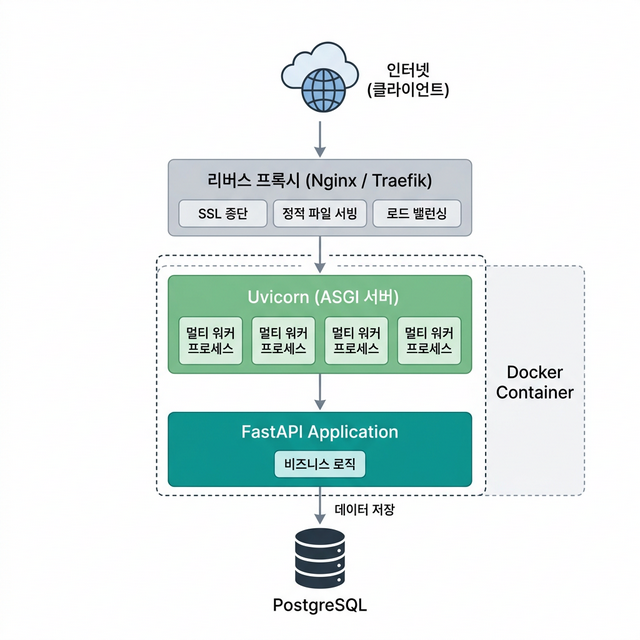

# 🚢 14 — 배포

## 학습 목표 (Goal)

FastAPI 앱을 Docker로 컨테이너화하고, Uvicorn 프로덕션 설정, docker-compose를 사용한 서비스 구성 방법을 학습합니다.

---

## 핵심 개념 (Core Concepts)

### 프로덕션 배포 구성

```
인터넷 (클라이언트)
       │
       ▼
  리버스 프록시 (Nginx/Traefik)     ← SSL 종단, 정적 파일, 로드 밸런싱
       │
       ▼
  Uvicorn (ASGI Server)              ← FastAPI 앱 실행
       │
       ▼
  FastAPI Application                 ← 비즈니스 로직
       │
       ▼
  Database (PostgreSQL)               ← 데이터 저장
```



### 개발 환경 vs 프로덕션 환경

| 항목 | 개발 환경 | 프로덕션 환경 |
|------|-----------|---------------|
| 서버 | `uvicorn --reload` | `uvicorn --workers N` (멀티 프로세스) |
| 데이터베이스 | SQLite | PostgreSQL / MySQL |
| 디버그 | `echo=True`, 상세 에러 | 로그 최소화, 에러 일반화 |
| 환경 변수 | `.env` 파일 | 시크릿 매니저, 환경 변수 |
| HTTPS | 불필요 | 필수 (리버스 프록시에서 처리) |

### Uvicorn 워커 수 가이드

프로덕션에서 Uvicorn은 여러 워커 프로세스를 실행하여 멀티코어 CPU를 활용합니다:

```
권장 워커 수 = (CPU 코어 수 × 2) + 1

예: 4코어 서버 → 9 워커
    2코어 서버 → 5 워커
```

---

## 실습 코드 (Hands-on)

### Step 1: 환경 변수 관리

**`app/config.py`**:

```python
# app/config.py
from pydantic_settings import BaseSettings


class Settings(BaseSettings):
    """
    환경 변수 기반 앱 설정.
    .env 파일 또는 시스템 환경 변수에서 값을 자동으로 읽습니다.
    """
    app_name: str = "FastAPI App"
    debug: bool = False

    # 데이터베이스
    database_url: str = "sqlite:///./app.db"

    # 인증
    secret_key: str = "change-this-in-production"
    access_token_expire_minutes: int = 60

    # 서버
    host: str = "0.0.0.0"
    port: int = 8000
    workers: int = 1

    model_config = {
        "env_file": ".env",          # .env 파일에서 값 로드
        "env_file_encoding": "utf-8",
        "case_sensitive": False,      # 환경 변수 대소문자 무시
    }


settings = Settings()
```

**`.env`** (Git에 커밋하지 않음):

```env
DATABASE_URL=postgresql://user:password@db:5432/appdb
SECRET_KEY=your-production-secret-key
DEBUG=false
WORKERS=4
```

> `pydantic-settings` 패키지가 필요합니다: `poetry add pydantic-settings`

### Step 2: Dockerfile 작성

**`Dockerfile`**:

```dockerfile
# ---- 빌드 스테이지 ----
FROM python:3.12-slim AS builder

WORKDIR /app

# Poetry 설치
RUN pip install --no-cache-dir poetry

# 의존성 파일만 먼저 복사 (Docker 빌드 캐시 활용)
COPY pyproject.toml poetry.lock ./

# 가상환경을 프로젝트 내에 생성하고 프로덕션 의존성만 설치
RUN poetry config virtualenvs.in-project true \
    && poetry install --only main --no-interaction --no-ansi

# ---- 런타임 스테이지 ----
FROM python:3.12-slim AS runtime

WORKDIR /app

# 빌드 스테이지에서 가상환경만 복사 (Poetry 설치 불필요)
COPY --from=builder /app/.venv ./.venv

# 앱 코드 복사
COPY . .

# 가상환경의 Python을 사용하도록 PATH 설정
ENV PATH="/app/.venv/bin:$PATH"

# 헬스체크
HEALTHCHECK --interval=30s --timeout=5s --retries=3 \
    CMD python -c "import httpx; httpx.get('http://localhost:8000/health')" || exit 1

# 포트 노출
EXPOSE 8000

# Uvicorn 실행
# --host 0.0.0.0: 모든 네트워크 인터페이스에서 접근 허용
# --workers: 멀티 프로세스 (프로덕션)
CMD ["uvicorn", "app.main:app", "--host", "0.0.0.0", "--port", "8000", "--workers", "4"]
```

멀티 스테이지 빌드를 사용하는 이유:
- **빌드 스테이지**: Poetry 설치, 의존성 설치
- **런타임 스테이지**: Poetry 없이 가상환경과 앱 코드만 포함
- 결과 이미지 크기를 줄여 배포 속도를 높이고 보안을 개선합니다.

### Step 3: .dockerignore 작성

**`.dockerignore`**:

```text
.venv
__pycache__
*.pyc
.git
.gitignore
.env
*.db
tests/
docs/
README.md
CHEATSHEET.md
```

### Step 4: docker-compose.yml 작성

**`docker-compose.yml`**:

```yaml
services:
  # FastAPI 앱
  app:
    build: .
    ports:
      - "8000:8000"
    environment:
      - DATABASE_URL=postgresql://appuser:apppass@db:5432/appdb
      - SECRET_KEY=${SECRET_KEY:-dev-secret-key}
      - DEBUG=false
    depends_on:
      db:
        condition: service_healthy
    restart: unless-stopped

  # PostgreSQL 데이터베이스
  db:
    image: postgres:16-alpine
    environment:
      - POSTGRES_USER=appuser
      - POSTGRES_PASSWORD=apppass
      - POSTGRES_DB=appdb
    volumes:
      - postgres_data:/var/lib/postgresql/data
    healthcheck:
      test: ["CMD-SHELL", "pg_isready -U appuser -d appdb"]
      interval: 5s
      timeout: 5s
      retries: 5
    restart: unless-stopped

volumes:
  postgres_data:
```

### Step 5: 헬스체크 엔드포인트

**`app/main.py`** 에 헬스체크 추가:

```python
# app/main.py (이어서 추가)

@app.get("/health")
def health_check():
    """
    헬스체크 엔드포인트.
    로드 밸런서, Docker 헬스체크, 모니터링 도구에서 사용합니다.
    """
    return {"status": "healthy"}
```

### Step 6: 빌드 및 실행

```bash
# Docker 이미지 빌드
docker build -t my-fastapi-app .

# 단독 실행
docker run -p 8000:8000 my-fastapi-app

# docker-compose로 실행 (앱 + DB)
docker compose up -d

# 로그 확인
docker compose logs -f app

# 중지
docker compose down
```

---

## Uvicorn 프로덕션 설정 옵션

```bash
uvicorn app.main:app \
    --host 0.0.0.0 \
    --port 8000 \
    --workers 4 \              # 멀티 프로세스 (CPU 코어 × 2 + 1)
    --log-level info \         # 로그 레벨 (debug, info, warning, error)
    --access-log \             # HTTP 접근 로그 활성화
    --proxy-headers \          # 리버스 프록시 뒤에서 실행 시 X-Forwarded-For 처리
    --forwarded-allow-ips "*"  # 프록시 IP 허용
```

---

## 마무리 및 다음 단계

이 단계에서 완료한 작업:
- `pydantic-settings`를 사용한 환경 변수 관리
- 멀티 스테이지 Dockerfile 작성
- docker-compose로 앱 + DB 구성
- 헬스체크 엔드포인트 구현
- Uvicorn 프로덕션 설정 옵션

**다음 단계**: [15 — 실전 프로젝트](15-final-project.md)에서 지금까지 학습한 모든 내용을 통합하여 완성형 Todo API를 구현합니다.
